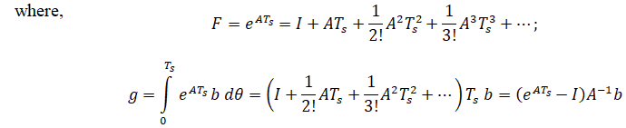

## Introduction

<b>Discipline | <b>Electrical Engineering 
:--|:--|
<b> Lab | <b> Digital Control Laboratory
<b> Experiment|     <b> Design of digital control systems with deadbeat response and other controllers and Exp 9

### About the Experiment 

Designing digital control systems with a deadbeat response aims to drive the output to the desired value in the shortest time, typically within a finite number of sampling periods, without oscillation or overshoot. 
This approach is well-suited for applications requiring fast and precise control. Deadbeat control is a linear strategy applied to discrete-time systems, focused on bringing each initial state to zero as quickly as possible.  
The controller is designed to reach the target value in exactly N steps, where N corresponds to the number of states in the system. The key idea is to cancel the system's dynamics by placing the poles of the closed-loop system at the origin (or on the unit circle for higher-order systems).  
Essentially, the deadbeat controller is the inverse of the plant's transfer function, with adjustments made to ensure stability and practicality. This method guarantees a quick and accurate response while maintaining system integrity.   
<b><i>Deadbeat controller design using State Space model:</i></b>  
Linear time invariant system may be represented in state space form by the following equations:
 
State equation:

$$ \dot{x}(t)=A x(t)+B u(t) \tag{1a} $$

Output equation:

$$ y(t)= C x(t) u(t) \tag{1b} $$

 
where, x(t) is state vector, y(t) is output vector, 
u is input or control vector, A is system matrix, 
B is input matrix, C is output matrix.  

                
Discrete state space form represented by the following equations  
State equation:

$$ {x}[k+1]=F x[k]+g u[k] \tag{2a} $$

Output equation:

$$ y[k]= C x[k] u[k] \tag{2b} $$

 

x[k] is state vector, y[k] is output vector, 
u is input or control vector, F is system matrix, 
g is input matrix, C is output matrix.   
The control input is typically given by: 

$$ u[k]= - K x[k] + r[k] \tag{3} $$

where, K is the state feedback gain matrix, r[k] is the reference signal (desired output). 

<b>Subject matter expertise | <b> **Prof. Alok Kanti Deb**
:--|:--|
<b> Institute | <b>  **Indian Institute of Technology Kharagpur**
<b> Email id|     <b>  **alokkanti@ee.iitkgp.ac.in**
<b> Department |  **Department of Electrical Engineering**
<b>Webpage| <b> http://www.iitkgp.ac.in/department/EE/faculty/ee-alokkanti

### Contributors List

SrNo | Name | VLabs Developer or Integration Engineer | Designation | Department| Institute
:--|:--|:--|:--|:--|:--|
1 | **Kamal Sandeep Karreddula** | Developer | Research Scholar | Department of Electrical Engineering | IIT Kharagpur | 
2 | **Piyali Chattopadhyay** | Integration Engineer | Project Scientist | Department of Mechanical Engineering | IIT Kharagpur |

