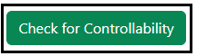
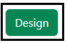

### Procedure

<b>Steps to perform the simulation</b>

<ol type="1">

<li> Enter the values of the Mechanical system parameters.</li> 

  
<b>Fig. 1. Parameter values of the Mechanical system</b> 						  

 

<li> Click on 'State Space Model' button to get the continuous state space form of the system.</li> 

            

<b>Fig. 2. Button to get the state Space form of the system</b> 							  

 

<li> Click on 'Discrete State Space Model' button to get the discrete state space form of the system.</li> 

            

 

<b>Fig. 3. Button to get the discrete state Space form of the system</b> 							  

 

<li> Click on 'Check for Controllabilty' button to get check the controllability of the system.</li> 

            

 

<b>Fig. 4. Button to check the controllability of the system </b> 							  

 

<li> Click on the 'Rank' or 'Determinant'  or "Inference' buttons to get the the Controllability test. </li> 

  
<b>Fig. 5. Button to get Rank, Determinant, Inference of the Controllability test </b> 						  

  

<li> Click on 'Design' dropdown button and select the desired option for the design. </li> 

  
<b>Fig. 6. Dropdown button for selecting the required design option </b> 						  

 

<li> Click on the 'Run' button to run the selected design. </li> 

  
<b>Fig. 7. Run button to calculate the selected design </b> 						  

 

<li> Click on ' Enter the Pole Location' button to enter the desired pole values for state feedback method. </li> 

  
<b>Fig. 8. Button to enter the desired pole values </b> 						  

 

<li> Click on ' Desing' button to get the gain values for the state feedback method. </li> 

  
<b>Fig. 9. Button to design gain values </b> 						  

 

<li> Click on 'Clear' button to enter the new parameter values of the system.</li>  

</ol>

