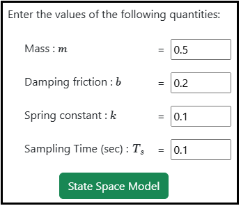
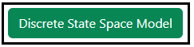
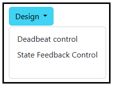
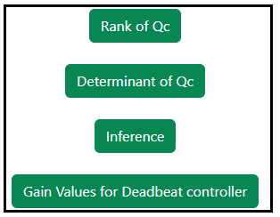

### Procedure

<b>Steps to perform the simulation</b>

										
1. Enter the values of the Mechanical system parameters.

<b>Fig. 1. Parameter values of the Mechanical system</b>						  

2. Click on 'State Space Model' button to get the continuous state space form of the system.

          

<b>Fig. 2. Button to get the state Space form of the system</b>							  

        
3. Click on 'Discrete State Space Model' button to get the discrete state space form of the system. 

           

<b>Fig. 3. Button to get the discrete state Space form of the system</b>						  

4. Click on 'Design' dropdown button and select the desired option for the design. 

<b>Fig. 4. Dropdown button for selecting the required design option</b>						  

5. Click on the 'Run' button to run the selected design. 

<b>Fig. 5. Run button to calculate the selected design</b>						  

6. Click on the 'Rank' or 'Determinant'  or "inference' buttons to get the the Controllability test information and state feedback gain values for the Deadbeat control. 

<b>Fig. 6. Button to get Rank, determinant, inference of the Controllability test and state feedback gain values for the Deadbeat control </b>						  

7. Click on 'Clear' button to enter the new parameter values of the system.

